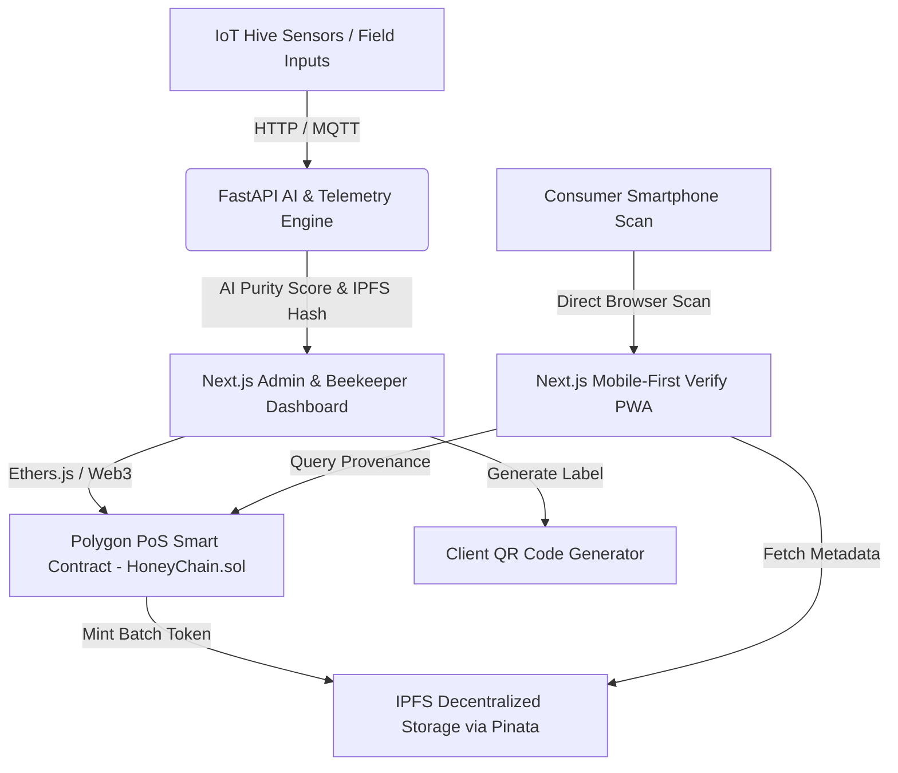

<div align="center">


# 🍯 HoneyChain by TrueTag
### Smart India Hackathon (SIH) 2026 — Problem Statement: SIH26021
**Blockchain-Based Honey Traceability, AI Quality Verification & Smart Beekeeping Platform**

[](https://sih.gov.in)
[](https://sih.gov.in)
[](https://www.kvic.gov.in)
[](https://polygon.technology)
[](https://nextjs.org)
[](https://fastapi.tiangolo.com)

---

**Contributor & Lead:** [Shivam Gawade](https://github.com/ShivamGawade-XS) ([@ShivamGawade-XS](https://github.com/ShivamGawade-XS))

</div>

---

## 📌 Executive Summary

**HoneyChain** (powered by the **TrueTag** authentication platform) is an end-to-end decentralized traceability and intelligence system built for **KVIC (Khadi and Village Industries Commission)** and the **National Bee Board**.

It bridges rural beekeepers with health-conscious urban consumers by linking physical honey jars to immutable blockchain records, IoT hive telemetry, and AI quality grading — empowering small-scale farmers to prove authenticity and capture premium GI-tagged pricing.

```
┌─────────────────┐       ┌─────────────────┐       ┌─────────────────┐       ┌─────────────────┐
│  Hive & Farmer  │  ───> │  IoT Telemetry  │  ───> │ Polygon Batch   │  ───> │  Consumer Scan  │
│  Registration   │       │  & AI Quality   │       │ Token Minting   │       │ (3-Sec Verify)  │
└─────────────────┘       └─────────────────┘       └─────────────────┘       └─────────────────┘
```

---

## 🚨 The Crisis: Problem Context & Market Analysis

India produces over **1.2 lakh metric tonnes** of honey annually worth **₹1,200+ crore in exports**. However, FSSAI quality reports indicate that **70% to 80% of honey sold in domestic markets is adulterated** with invert sugar syrup, corn syrup, or cheap imported substitutes.

### The Structural Challenges:

1. **Lack of Authentication**: Authentic beekeepers in rural clusters (e.g., Sundarbans, Kashmir, Rajasthan) cannot prove batch purity to buyers.
2. **Middleman Exploitation**: Beekeepers receive low commodity pricing (~₹80–120/kg) while consumers pay ₹400–800/kg for unverified brand labels.
3. **Manual Hive Management**: Disease outbreaks (Varroa mites, colony collapse) and swarming go undetected due to lack of real-time monitoring.

---

## 🚀 The Solution: HoneyChain Ecosystem

HoneyChain transforms honey into a **verifiable, scannable digital asset** through a 5-step provenance pipeline:

### 1. Beekeeper & Apiary Onboarding
KVIC field officers register farmers with Aadhaar-linked digital IDs, GPS apiary coordinates, and cooperative affiliation.

### 2. Real-Time IoT Monitoring
Smart hive sensors record continuous weight, ambient/internal temperature, and humidity. AI algorithms analyze weight trends to detect swarming risks or honey-flow periods.

### 3. Immutable Batch Token Minting
During harvest, field officers log Brix index, moisture %, and yield weight. A **Batch Token** is minted on the **Polygon PoS Blockchain** with an IPFS metadata hash containing full provenance records.

### 4. Smart QR Code Generation
Dynamic QR codes are generated per batch and printed directly onto physical honey jar labels.

### 5. 3-Second Mobile Consumer Verification
Consumers scan the QR code via any mobile browser (no app required) to instantly view:
- Beekeeper profile, photo, and interactive hive GPS map
- Harvest timestamp & IoT environmental conditions
- AI Purity Score (0–100) & Lab Parameter breakdown
- Immutable Polygon Transaction Hash on Polygonscan
- KVIC Authentic Product Verification Badge

---

## 🏗 System Architecture



---

## 🛠 Tech Stack

| Layer | Technology | Purpose |
|---|---|---|
| **Blockchain** | Polygon PoS (Sepolia Testnet) | Low-cost, fast EVM smart contract execution (~₹0.01/tx) |
| **Smart Contracts** | Solidity + Hardhat | ERC-721 / Custom batch custody tracking contract |
| **Frontend** | Next.js 14 (App Router) + Tailwind CSS | Fast, SSR-optimized Beekeeper Dashboard & Consumer Verification UI |
| **Backend & AI** | Python FastAPI + Scikit-Learn | Real-time AI quality scoring & hive disease prediction model |
| **Decentralized Storage** | IPFS via Pinata | Immutable storage of farmer media, lab test results, and batch metadata |
| **Mapping & UI** | Leaflet.js + Lucide Icons | Open-source interactive map visualization for apiary locations |
| **IoT Telemetry** | Python Simulation + MQTT | Real-time hive sensor simulation engine |

---

## 📂 Repository Structure

```
SIH_2026/
├── README.md                          # Comprehensive Documentation
├── TrueTag_HoneyChain_SIH2026_MASTER.md # Master Strategy & Build Document
├── TrueTag_SIH2026_Complete.md        # Problem & Market Deconstruction
├── contracts/                         # Solidity Smart Contracts & Hardhat Setup
│   ├── contracts/
│   │   └── HoneyChain.sol             # Master Honey Provenance Contract
│   ├── scripts/
│   │   └── deploy.js                  # Deployment script for Polygon network
│   ├── hardhat.config.js              # Hardhat configuration
│   └── package.json
├── frontend/                          # Next.js 14 Web Application
│   ├── src/
│   │   ├── app/                       # App Router (Dashboard, Verify, Register)
│   │   ├── components/                # Reusable UI Components (QR, Map, Cards)
│   │   └── lib/                       # Web3 & API helper functions
│   ├── public/                        # Static assets
│   ├── package.json
│   └── tailwind.config.js
├── ai_service/                        # Python FastAPI Microservice
│   ├── main.py                        # FastAPI routes & prediction endpoints
│   ├── model/                         # Scikit-learn model artifacts (.pkl)
│   ├── requirements.txt               # Python dependencies
│   └── README.md
└── iot_simulator/                     # Hive Sensor Telemetry Generator
    ├── simulator.py                   # Real-time hive sensor data generator
    └── requirements.txt
```

---

## ⚡ Quick Start & Local Setup Guide

### Prerequisites
- **Node.js**: v18.0.0 or higher
- **Python**: v3.9 or higher
- **Git**: Installed
- **MetaMask / Web3 Wallet**: Configured for Polygon Sepolia Testnet

---

### 1. Clone the Repository
```bash
git clone https://github.com/ShivamGawade-XS/SIH_2026.git
cd SIH_2026
```

---

### 2. Deploy Smart Contracts (`contracts/`)
```bash
cd contracts
npm install

# Compile contracts
npx hardhat compile

# Deploy to Polygon Sepolia Testnet (Requires PRIVATE_KEY in .env)
npx hardhat run scripts/deploy.js --network sepolia
```

---

### 3. Run AI Microservice (`ai_service/`)
```bash
cd ../ai_service
python -m venv venv
# On Windows:
venv\Scripts\activate
# On Linux/macOS:
source venv/bin/activate

pip install -r requirements.txt
uvicorn main:app --reload --port 8000
```
> AI service running at: `http://localhost:8000` (Swagger docs at `http://localhost:8000/docs`)

---

### 4. Run Frontend Dashboard (`frontend/`)
```bash
cd ../frontend
npm install

# Set environment variables (.env.local)
# NEXT_PUBLIC_CONTRACT_ADDRESS=0x...
# NEXT_PUBLIC_RPC_URL=https://rpc-sepolia.polygon.technology

npm run dev
```
> Web Application running at: `http://localhost:3000`

---

### 5. Launch IoT Telemetry Simulator (`iot_simulator/`)
```bash
cd ../iot_simulator
python simulator.py
```

---

## 📜 Smart Contract Overview (`HoneyChain.sol`)

```solidity
// SPDX-License-Identifier: MIT
pragma solidity ^0.8.19;

/**
 * @title HoneyChain - Honey Traceability & Authentication
 * @dev Tracks honey harvest batches, farmer profiles, and custody transfers on Polygon.
 */
contract HoneyChain {
    struct Farmer {
        uint256 farmerId;
        string name;
        string location;
        string cooperativeId;
        bool isVerified;
    }

    struct Batch {
        uint256 batchId;
        uint256 farmerId;
        uint256 harvestTimestamp;
        string ipfsHash;
        uint8 qualityScore;
        bool isAuthentic;
    }

    mapping(uint256 => Farmer) public farmers;
    mapping(uint256 => Batch) public batches;
    mapping(string => uint256) public qrToBatch;

    event BatchMinted(uint256 indexed batchId, uint256 indexed farmerId, string ipfsHash);
    event FarmerRegistered(uint256 indexed farmerId, string name);

    function registerFarmer(uint256 _farmerId, string memory _name, string memory _location, string memory _coopId) external {
        farmers[_farmerId] = Farmer(_farmerId, _name, _location, _coopId, true);
        emit FarmerRegistered(_farmerId, _name);
    }

    function mintBatch(uint256 _batchId, uint256 _farmerId, string memory _ipfsHash, uint8 _score) external {
        require(farmers[_farmerId].isVerified, "Farmer not verified by KVIC");
        batches[_batchId] = Batch(_batchId, _farmerId, block.timestamp, _ipfsHash, _score, true);
        emit BatchMinted(_batchId, _farmerId, _ipfsHash);
    }
}
```

---

## 🎯 SIH 2026 Judge Q&A & Technical Defense Guide

### Q1. "Consumer scan rates on food products globally are under 3%. Why would an average Indian consumer, buying honey at a kirana store, scan a QR code? You're solving a problem consumers don't know they have."

> **Definitive Answer:**
> 1. **High-Motivation Trigger Points**: Passive packaging QR codes get <3% scans, but HoneyChain targets two deliberate high-intent touchpoints:
>    - **E-Commerce Listings (Amazon / Flipkart / ONDC)**: Product description displays *"Scan on delivery to verify batch authenticity"* — digital-native buyers in this segment actively verify products.
>    - **Premium Retail Shelf-Talkers**: For premium raw/organic honey priced at ₹500–800/kg (vs ₹200 commercial syrup), the QR code acts as the **instant justification for premium pricing** directly at the point of sale.
> 2. **Regulatory Pull (FSSAI 2025 E-Labeling Guidelines)**: KVIC and certified honey brands use "Blockchain Verified" claims to comply with upcoming FSSAI digital transparency norms, driving structural adoption.
> 3. **The Real ROI is B2B & Export Compliance**: The primary economic return of HoneyChain is **B2B export documentation**. Cooperatives and exporters use immutable on-chain batch passports to satisfy strict APEDA, USFDA, and EU carbon isotope ($^{13}\text{C}$) / NMR traceability audits. Consumer trust is a powerful secondary advantage.

---

### Q2. "You claim Varroa mite detection accuracy on CNN models. On what data? India primarily uses *Apis cerana indica* — not the European *Apis mellifera* in Western datasets."

> **Definitive Answer:**
> 1. **Honest Dataset Attribution**: Open benchmark datasets (e.g. BeeImage) are Western *Apis mellifera* baselines.
> 2. **Species-Transferable Morphological Signals**: The vision model inspects physical frame-level pathology (reddish-brown mite clusters, perforated brood cell cappings, and comb decay) rather than individual bee taxonomy — visual symptoms that are structurally identical across both Western and native Indian bee species.
> 3. **Indian Dataset Pipeline & ICAR Partnership**: Post-SIH field rollout equips KVIC field officers with mobile inspection tools to capture geo-tagged *Apis cerana indica* frame imagery, while establishing an official data validation pipeline with **ICAR-AICRP on Honeybees & Pollinators**.

---

### Q3. "What stops a counterfeiter from buying one genuine jar, copying the QR code, and printing it on 10,000 fake jars?"

> **Definitive Answer:**
> 1. **Unit-Level Serial Encoding**: Every jar carries a unique serial token `HC-{YEAR}-{BATCH_ID}-{UNIT_SERIAL}` (e.g., `HC-2026-00142-037`) derived from harvest mass ($42.5\text{ kg} \rightarrow 85\text{ units}$).
> 2. **First-Scan Activation vs. Duplicate Warnings**: The genuine buyer's first scan activates the unit on-chain. Subsequent scans on the same serial immediately alert the buyer: *"Warning: This QR serial has already been scanned multiple times. Check lid tamper seal."*
> 3. **$3\times$ Volume Anomaly Engine**: If total scans on a batch exceed $3\times \text{expectedUnitCount}$ (e.g., $>255$ scans on an 85-jar batch), the backend automatically flags the batch as disputed and dispatches an instant red alert to the KVIC District Supervisor for retail recall.

---

## 📈 Impact & Business Model

- **Beekeeper Earnings**: Direct provenance increases market price realization by **2x to 3x** per kg.
- **KVIC Monetization**: B2B SaaS model for honey brands requiring automated blockchain certification.
- **Consumer Trust**: Zero-friction verification builds consumer brand equity for Indian GI-tagged products.

---

## 👥 Authors & Contributors

- **Shivam Gawade** — Lead Developer & Contributor ([@ShivamGawade-XS](https://github.com/ShivamGawade-XS))
- **Team TrueTag** — SIH 2026 Participants

---

## 📄 License

This project is open-sourced under the [MIT License](LICENSE).
