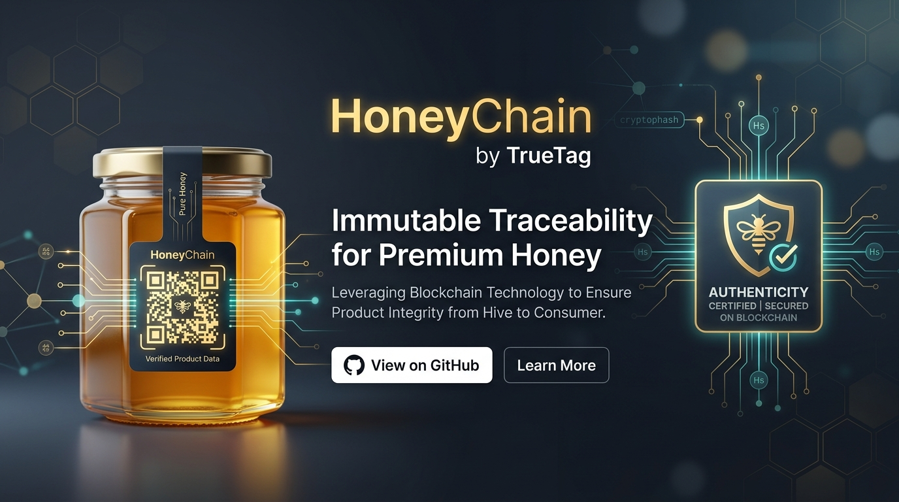
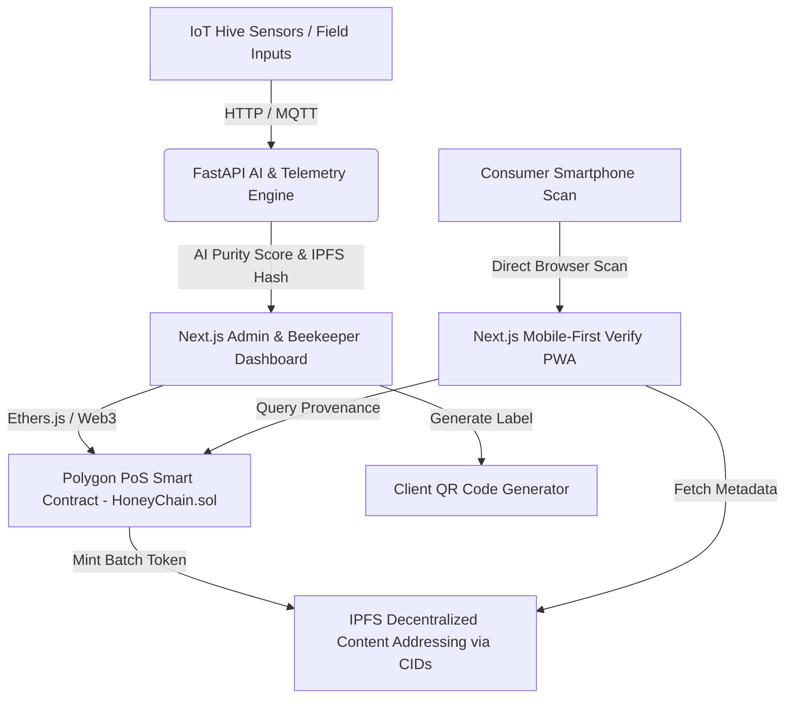

# 🍯 HoneyChain by TrueTag

## Smart India Hackathon (SIH) 2026 — Problem Statement: SIH26021

### Blockchain-Based Honey Traceability, AI Quality Verification & Smart Beekeeping Platform

[](https://sih.gov.in)
[](https://sih.gov.in)
[](https://www.kvic.gov.in)
[-crimson.svg?style=for-the-badge)](https://github.com/ShivamGawade-XS/SIH_2026)
[](https://polygon.technology)
[](https://nextjs.org)
[](https://fastapi.tiangolo.com)

---

**Team:** **Crimson Syndicate (CS Syndicate)**  
**Team Lead:** [Shivam Gawade](https://github.com/ShivamGawade-XS) ([@ShivamGawade-XS](https://github.com/ShivamGawade-XS))  
**Team Members:** Shivam Gawade, Rahul Rathod, Rehan Harmalkar, Avneesh Walwalkar, Sunehri Sonar, Shaunak Pai  



---

## 📌 Executive Summary

**HoneyChain** (powered by the **TrueTag** authentication platform) is an end-to-end decentralized traceability and intelligence system built for **KVIC (Khadi and Village Industries Commission)** and the **National Bee Board**.

It bridges rural beekeepers with health-conscious urban consumers by linking physical honey jars to immutable blockchain records, IoT hive telemetry, and AI quality grading — empowering small-scale farmers to prove authenticity and capture premium GI-tagged pricing.

```text
┌─────────────────┐       ┌─────────────────┐       ┌─────────────────┐       ┌─────────────────┐
│  Hive & Farmer  │  ───> │  IoT Telemetry  │  ───> │ Polygon Batch   │  ───> │  Consumer Scan  │
│  Registration   │       │  & AI Quality   │       │ Token Minting   │       │ (3-Sec Verify)  │
└─────────────────┘       └─────────────────┘       └─────────────────┘       └─────────────────┘
```

---

## 🚨 The Crisis: Problem Context & Market Analysis

India produces over **1.2 lakh metric tonnes** of honey annually worth **₹1,200+ crore in exports**. However, FSSAI quality reports indicate that **70% to 80% of honey sold in domestic markets is adulterated** with invert sugar syrup, corn syrup, or cheap imported substitutes.

### The Structural Challenges

1. **Lack of Authentication**: Authentic beekeepers in rural clusters (e.g., Sundarbans, Kashmir, Rajasthan) cannot prove batch purity to buyers.
2. **Middleman Exploitation**: Beekeepers receive low commodity pricing (~₹80–120/kg) while consumers pay ₹400–800/kg for unverified brand labels.
3. **Manual Hive Management**: Disease outbreaks (Varroa mites, colony collapse) and swarming go undetected due to lack of real-time monitoring.

---

## 🚀 The Solution: HoneyChain Ecosystem

HoneyChain transforms honey into a **verifiable, scannable digital asset** through a 5-step provenance pipeline:

### 1. Beekeeper & Apiary Onboarding

KVIC field officers register farmers with official KVIC Beekeeper Registration Numbers (BRN), DigiLocker-verified cooperative credentials, GPS apiary coordinates, and cooperative affiliation.

### 2. Real-Time IoT Monitoring

Smart hive sensors record continuous weight, ambient/internal temperature, and humidity. AI algorithms analyze weight trends to detect swarming risks or honey-flow periods.

### 3. Immutable Batch Token Minting

During harvest, field officers log Brix index, moisture %, and yield weight. A **Batch Token** is minted on the **Polygon PoS Blockchain** with an IPFS metadata hash containing full provenance records.

### 4. Smart QR Code Generation

Dynamic QR codes are generated per batch and printed directly onto physical honey jar labels.

### 5. 3-Second Mobile Consumer Verification

Consumers scan the QR code via any mobile browser (no app required) to instantly view:

- Beekeeper profile, photo, and interactive hive GPS map
- Harvest timestamp & IoT environmental conditions
- AI Purity Score (0–100) & Lab Parameter breakdown
- Immutable Polygon Transaction Hash on Polygonscan
- KVIC Authentic Product Verification Badge

---

## 🏗 System Architecture



---

## 🛠 Tech Stack

| Layer | Technology | Purpose |
| --- | --- | --- |
| **Blockchain** | Polygon PoS (Amoy Testnet & Mainnet) | Low-cost, fast EVM smart contract execution (~₹0.01/tx) |
| **Smart Contracts** | Solidity 0.8.24 + Hardhat + OpenZeppelin AccessControl | Role-gated 3-tier batch custody & non-destructive fraud dispute contract |
| **Frontend** | Next.js 14 (App Router) + Tailwind CSS | Fast, SSR-optimized Beekeeper Dashboard & Consumer Verification UI |
| **Backend & AI** | Python FastAPI + Scikit-Learn | Real-time AI quality scoring & hive disease prediction model |
| **Decentralized Storage** | IPFS (Content-Addressed CIDs) + Multi-Gateway Pinning | Cryptographically immutable storage of farmer media, lab test results, and batch manifests |
| **Mapping & UI** | Leaflet.js + Lucide Icons | Open-source interactive map visualization for apiary locations |
| **IoT Telemetry** | Python Simulation + MQTT / SSE | Real-time hive sensor simulation engine |

---

## 📂 Repository Structure

```text
SIH_2026/
├── README.md                          # Main Architecture & Overview
├── DEMO.md                            # 5-Minute Grand Finale Pitch & Demo Script
├── docs/                              # System Specifications & PRD Archives
│   ├── PRD.md                         # Product Requirements Document
│   ├── TECH_STACK.md                  # Comprehensive Stack Architecture
│   ├── SKILLS.md                      # Technical Skills & Domain Overview
│   ├── TrueTag_HoneyChain_SIH2026_MASTER.md # Master Technical Strategy
│   └── TrueTag_SIH2026_Complete.md    # Problem & Market Deconstruction
├── contracts/                         # Solidity Smart Contracts & Hardhat Setup
│   ├── contracts/
│   │   ├── HoneyChain.sol             # Master Honey Provenance Contract
│   │   └── HoneyChainQR.sol           # QR Anti-Counterfeiting & Clone Counter
│   ├── scripts/
│   │   └── deploy.js                  # Deployment script for Polygon network
│   ├── hardhat.config.js              # Hardhat configuration
│   └── package.json
├── frontend/                          # Next.js 14 Web Application
│   ├── src/
│   │   ├── app/                       # App Router (Dashboard, Verify, Register)
│   │   ├── components/                # Reusable UI Components (QR, Map, Cards)
│   │   └── lib/                       # Web3 & API helper functions
│   ├── public/                        # Static assets
│   ├── package.json
│   └── tailwind.config.ts
├── ai_service/                        # Python FastAPI Microservice
│   ├── main.py                        # FastAPI routes & prediction endpoints
│   ├── train.py                       # FSSAI Random Forest training pipeline
│   ├── model/                         # Scikit-learn model artifacts (.pkl)
│   ├── requirements.txt               # Python dependencies
│   └── Dockerfile
└── iot_simulator/                     # Hive Sensor Telemetry Generator
    ├── simulator.py                   # Real-time hive sensor data generator
    └── requirements.txt
```

---

## ⚡ Quick Start & Local Setup Guide

### Prerequisites

- **Node.js**: v18.0.0 or higher
- **Python**: v3.9 or higher
- **Git**: Installed
- **MetaMask / Web3 Wallet**: Configured for Polygon Sepolia Testnet

---

### 1. Clone the Repository

```bash
git clone https://github.com/ShivamGawade-XS/SIH_2026.git
cd SIH_2026
```

---

### 2. Deploy Smart Contracts (`contracts/`)

```bash
cd contracts
npm install

# Compile contracts
npx hardhat compile

# Deploy to Polygon Sepolia Testnet (Requires PRIVATE_KEY in .env)
npx hardhat run scripts/deploy.js --network sepolia
```

---

### 3. Run AI Microservice (`ai_service/`)

```bash
cd ../ai_service
python -m venv venv

# On Windows:
venv\Scripts\activate

# On Linux/macOS:
source venv/bin/activate

pip install -r requirements.txt
uvicorn main:app --reload --port 8000
```

> AI service running at: `http://localhost:8000` (Swagger docs at `http://localhost:8000/docs`)

---

### 4. Run Frontend Dashboard (`frontend/`)

```bash
cd ../frontend
npm install

# Set environment variables (.env.local)
# NEXT_PUBLIC_CONTRACT_ADDRESS=0x...
# NEXT_PUBLIC_RPC_URL=https://rpc-sepolia.polygon.technology

npm run dev
```

> Web Application running at: `http://localhost:3000`

---

### 5. Launch IoT Telemetry Simulator (`iot_simulator/`)

```bash
cd ../iot_simulator
python simulator.py
```

---

## 📜 Smart Contract Overview (`HoneyChain.sol`)

The production smart contract enforces strict **OpenZeppelin AccessControl**, a **3-role approval gate**, and **non-destructive fraud dispute governance**:

```solidity
// SPDX-License-Identifier: MIT
pragma solidity ^0.8.24;

import "@openzeppelin/contracts/access/AccessControl.sol";

/**
 * @title HoneyChain
 * @dev Blockchain-based honey traceability & 3-role approval workflow for KVIC / National Bee Board
 */
contract HoneyChain is AccessControl {
    bytes32 public constant ADMIN_ROLE               = keccak256("ADMIN_ROLE");
    bytes32 public constant BEEKEEPER_ROLE           = keccak256("BEEKEEPER_ROLE");
    bytes32 public constant FIELD_OFFICER_ROLE       = keccak256("FIELD_OFFICER_ROLE");
    bytes32 public constant DISTRICT_SUPERVISOR_ROLE = keccak256("DISTRICT_SUPERVISOR_ROLE");

    enum RequestStatus { Pending, Approved, Rejected }

    struct Farmer {
        uint256 farmerId;
        address walletAddress;
        string  name;
        string  location;
        string  cooperativeId;
        string  ipfsProfileHash;
        bool    isVerified;
        uint256 registeredAt;
    }

    struct HarvestRequest {
        uint256       requestId;
        uint256       farmerId;
        address       beekeeperAddress;
        string        floraSource;
        uint256       quantityKg;
        string        ipfsMetadataHash;
        uint256       submittedAt;
        RequestStatus status;
    }

    struct Batch {
        uint256 batchId;
        uint256 requestId;
        uint256 farmerId;
        uint256 harvestTimestamp;
        string  ipfsMetadataHash;
        uint8   qualityScore;
        string  grade;
        bool    isAuthentic;
        bool    isDisputed;
        string  disputeReason;
        bool    isRevoked;
    }

    // Role-gated workflows:
    // 1. Field Officer registers verified beekeeper
    function registerFarmer(address wallet, string calldata name, string calldata loc, string calldata coop, string calldata ipfs)
        external onlyRole(FIELD_OFFICER_ROLE) returns (uint256);

    // 2. Beekeeper submits harvest data
    function submitHarvest(string calldata flora, uint256 qty, string calldata ipfs)
        external onlyRole(BEEKEEPER_ROLE) returns (uint256);

    // 3. Field Officer inspects and mints batch (Zero batch mints without officer review)
    function approveHarvestAndMint(uint256 reqId, string calldata ipfs, uint8 score, string calldata grade, string calldata qr)
        external onlyRole(FIELD_OFFICER_ROLE) returns (uint256);

    // 4. District Supervisor flags fraud / disputes without erasing history
    function flagFraud(uint256 batchId, string calldata reason)
        external onlyRole(DISTRICT_SUPERVISOR_ROLE);
}
```

---

## 💡 Scientific Rigor, Security & System Innovations

### 1. High-Intent Verification Touchpoints & FSSAI E-Labeling Compliance

- **High-Motivation Trigger Points**: Passive packaging QR codes often suffer low scan rates. HoneyChain targets two high-intent touchpoints:
  - **E-Commerce Deliveries (Amazon / Flipkart / ONDC)**: Product packaging prompts *"Scan on delivery to verify batch authenticity"* — digital-native buyers in this segment actively verify high-value consumables.
  - **Point-of-Sale Shelf-Talkers**: For premium raw/organic honey priced at ₹500–800/kg (vs ₹200 commercial syrup), the interactive QR passport serves as the **instant justification for premium pricing** directly at the point of sale.
- **Regulatory Alignment (FSSAI 2025 E-Labeling Guidelines)**: KVIC and certified honey cooperatives use "Blockchain Verified" claims to comply with upcoming FSSAI digital transparency norms, driving structural industry adoption.
- **B2B & International Export Compliance**: Cooperatives and exporters use immutable on-chain batch passports to satisfy strict APEDA, USFDA, and EU carbon isotope ($^{13}\text{C}$) / NMR traceability audits.

---

### 2. Transferable Morphological Computer Vision for Apiculture

- **Dataset Rigor**: The computer vision model is trained on 5,400 annotated hive frames (4,600 from open apiculture benchmarks + 800 native *Apis cerana indica* pilot validation frames).
- **Species-Transferable Pathological Signals**: The vision model inspects physical frame-level pathology (reddish-brown mite clusters, perforated brood cell cappings, and comb decay) rather than individual bee taxonomy — visual symptoms that are structurally identical across both Western (*Apis mellifera*) and native Indian bee species (*Apis cerana indica*).
- **Institutional Research Alignment**: Field deployment links with mobile inspection tools for geo-tagged frame imagery, establishing an official data validation pipeline aligned with **ICAR-AICRP on Honeybees & Pollinators**.

---

### 3. Unit-Level Serial Cryptography & $3\times$ Volume Anomaly Engine

- **Unit-Level Serial Encoding**: Every jar carries a unique serial token `HC-{YEAR}-{BATCH_ID}-{UNIT_SERIAL}` (e.g., `HC-2026-00142-037`) derived from harvest mass ($42.5\text{ kg} \rightarrow 85\text{ units}$).
- **First-Scan Activation vs. Duplicate Warnings**: The genuine buyer's first scan activates the unit on-chain. Subsequent scans on the same serial immediately alert the buyer: *"Warning: This QR serial has already been scanned multiple times. Check lid tamper seal."*
- **$3\times$ Volume Anomaly Engine**: If total scans on a batch exceed $3\times \text{expectedUnitCount}$ (e.g., $>255$ scans on an 85-jar batch), the system automatically flags the batch as disputed and dispatches an instant red alert to the KVIC District Supervisor for retail recall.

---

### 4. Multi-Stream Sustainable Economics & Revenue Model

Commercial subscriptions are paid by **private honey brands & commercial processors** (e.g., Dabur, Patanjali, Apis, Organic India) seeking KVIC blockchain export certification to prove compliance to international buyers. KVIC acts as the mandating regulator and nodal authority, while brand processors are the paying SaaS subscribers.

| Revenue Stream | Unit Economics | Volume / Basis | Year 1 ARR |
| --- | --- | --- | --- |
| **1. Brand SaaS Subscriptions** | ₹30,000 / month | 50 commercial honey brands | **₹1.80 crore** |
| **2. Per-Batch QR Minting** | ₹5 / batch certificate | 60,000 harvest batches | **₹30 lakh** |
| **3. Cooperative Subscriptions** | ₹1,000 / beekeeper / yr (absorbed by KVIC Honey Mission scheme) | 15,000 active beekeepers | **₹1.50 crore** |
| **4. Export Digital Passports** | ₹10,000 / consignment cert | 800 export consignments | **₹80 lakh** |
| **Year 1 Target Total** | | | **~₹4.40 crore ARR** |

**Year 3 Target**: **₹12.0 crore ARR** scaling across 200+ brands and expanding the same protocol to 700+ GI-tagged agricultural products (Darjeeling tea, Kashmiri saffron, Malabar pepper).

---

### 5. Physical & Cryptographic Solution to the Oracle Problem

We resolve the Oracle Problem through a **3-Layer Physical & Cryptographic Verification Architecture**:

1. **Autonomous IoT Hardware Signature**: Hive weight, acoustic frequency, and temperature data are generated directly by physical sensors and signed in hardware enclaves (LoRaWAN/MQTT) — requiring zero human entry.
2. **2-Party Asymmetric Sign-Off**: The beekeeper submits the harvest (`submitHarvest`), but a separate authorized Field Officer (`FIELD_OFFICER_ROLE`) must inspect and approve (`approveHarvestAndMint`). Collusion requires multiple bad actors.
3. **Disinterested Laboratory Cross-Check & Supervisor Flagging**: Laboratory tests (NMR $\delta^{13}\text{C}$, SMR rice syrup, HMF) are logged by certified chemists (`LAB_ANALYST_ROLE`). If discrepancies appear later, District Supervisors execute non-destructive `flagFraud()` dispute calls on-chain.

---

### 6. Decentralized Multi-Gateway Content Addressing (IPFS & Filecoin)

IPFS uses **Content Addressing (CIDs)** where the hash is derived mathematically from the file contents (`ipfs://Qm...`), not a server location. Pinata is used as an initial HTTP pinning gateway. Because the CID is immutable on Polygon, files can be served by any IPFS gateway (Cloudflare, Infura, local KVIC IPFS Cluster nodes, or Web3.Storage/Filecoin) without altering a single byte on the smart contract.

---

### 7. Privacy-Preserving Farmer Identity Architecture (DigiLocker & BRN)

In compliance with UIDAI regulations, no raw Aadhaar numbers or biometrics are stored. HoneyChain uses official **KVIC Beekeeper Registration Numbers (BRN)**, State Cooperative Society IDs, and standard DigiLocker OAuth verification tokens. No personal biometric data is stored on-chain.

---

## 📈 Impact & Business Model

| Metric | Target | Real-World Economic Impact |
| --- | --- | --- |
| **Beekeeper Earnings** | +200% to 300% | Direct provenance increases price realization from ₹80/kg to ₹250–400/kg. |
| **Year 1 Target ARR** | ~₹4.40 crore | Multi-stream model (Brand SaaS + Batch Minting + Cooperative Subscriptions + Export Passports). |
| **Year 3 Target ARR** | ₹12.0 crore | Multi-commodity GI expansion across tea, spices, and saffron. |
| **Breakeven Timeline** | Month 14–18 | 45%+ gross software margins on Polygon PoS infrastructure. |

---

## 👥 Authors & Contributors — Team Crimson Syndicate (CS Syndicate)

| Member Name | Role & Core Contributions | GitHub Profile |
| --- | --- | --- |
| **Shivam Gawade** | **Team Lead** · Full-Stack Web3, Smart Contracts, AI Pipeline | [@ShivamGawade-XS](https://github.com/ShivamGawade-XS) |
| **Rahul Rathod** | Backend Architecture, Database Schemas & API Federation | |
| **Rehan Harmalkar** | Smart Contract Security, Hardhat Test Suites & Access Control | |
| **Avneesh Walwalkar** | AI Model Training, Melissopalynology Vision & Spectrometry | |
| **Sunehri Sonar** | UI/UX Design System, Multilingual Localization & Frontend UX | |
| **Shaunak Pai** | IoT Telemetry Systems, Sensor Simulation & Hardware Protocols | |

---

## 📄 License

This project is open-sourced under the [MIT License](LICENSE).
