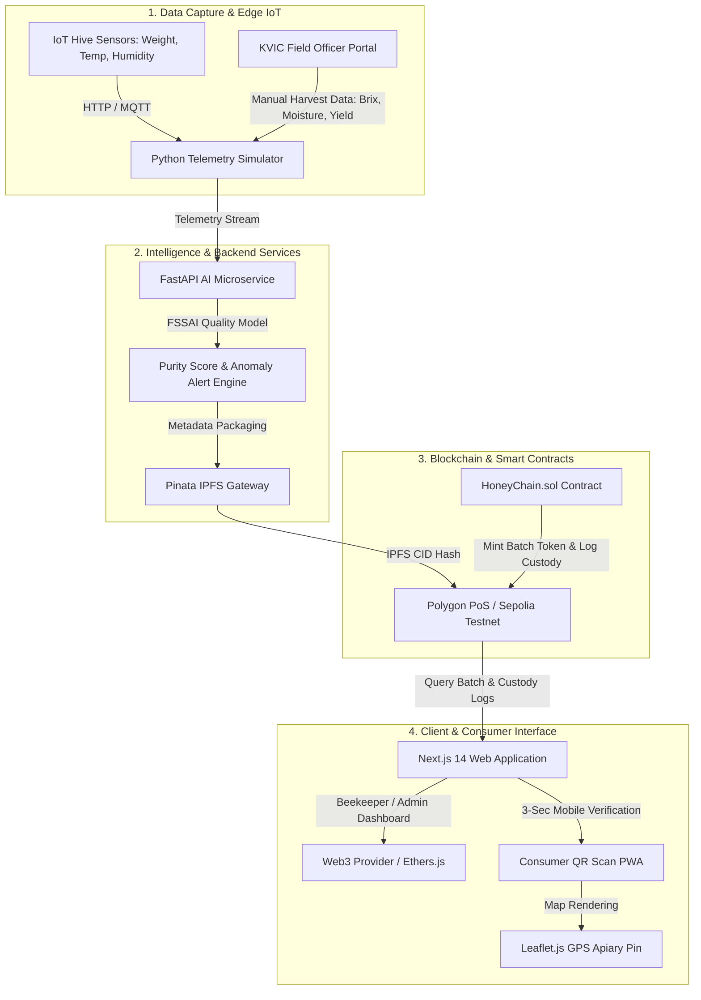

# 🛠️ Technical Architecture & Tech Stack Specification
## HoneyChain by TrueTag — SIH 2026 (PS: SIH26021)
**Platform**: TrueTag Universal Authentication Engine  
**Lead Contributor**: [Shivam Gawade](https://github.com/ShivamGawade-XS) ([@ShivamGawade-XS](https://github.com/ShivamGawade-XS))  
**Document Version**: 1.0.0

---

## 1. High-Level Architecture Overview

HoneyChain is built on a modular 4-tier architecture designed for high throughput, zero transaction latency for consumers, and near-zero gas costs for rural beekeepers.



---

## 2. Complete Technology Stack Matrix

| Layer / Component | Technology | Version | Key Justification for SIH 2026 |
|---|---|---|---|
| **Blockchain Network** | Polygon PoS (Sepolia Testnet) | EVM (Paris) | Sub-second finality, near-zero gas fees (~₹0.01/tx), full Ethereum ecosystem compatibility. |
| **Smart Contracts** | Solidity + Hardhat | Solidity `^0.8.19`, Hardhat `^2.19.4` | Industry-standard security, automated test suites, fast local debugging and deployment. |
| **Web3 Client Bridge** | Ethers.js | `^6.11.1` | Lightweight, native TypeScript support, modern async provider & contract abstraction. |
| **Frontend Framework** | Next.js 14 (App Router) | `^14.1.0` | React Server Components for ultra-fast mobile verification page load (<1.5s), SEO optimization. |
| **Styling & Icons** | Tailwind CSS + Lucide React | `^3.4.1` / `^0.330.0` | Clean, responsive dark/light UI design system with zero redundant CSS bundle overhead. |
| **Mapping Engine** | Leaflet.js | `^1.9.4` | Open-source interactive map without requiring paid Google Maps API keys during demo. |
| **QR Code Engine** | `qrcode.react` + `html5-qrcode` | `^3.1.0` / `^2.3.8` | Client-side QR generation and in-browser camera scanning without external API dependencies. |
| **AI Backend Service** | Python FastAPI | `^0.104.0` | High-performance asynchronous REST API framework with native OpenAPI/Swagger documentation. |
| **Machine Learning** | Scikit-Learn + NumPy | `^1.3.0` / `^1.24.3` | FSSAI-compliant honey purity scoring model and hive anomaly classification. |
| **Decentralized Storage** | IPFS via Pinata Gateway | REST API v3 | Permanent, decentralized storage for farmer photos, batch certificates, and IoT logs. |
| **IoT Telemetry Engine** | Python 3 + Requests | Python `3.9+` | Simulates realistic hive weight fluctuations, swarming events, and thermal stress. |

---

## 3. Data Schemas & Contracts

### 3.1 Smart Contract Structs (`HoneyChain.sol`)

```solidity
struct Farmer {
    uint256 farmerId;       // Unique ID (Aadhaar / KVIC hash)
    string name;            // "Ramesh Kumar"
    string location;        // "Sundarbans, West Bengal"
    string cooperativeId;   // "KVIC-WB-04"
    bool isVerified;        // Verified by KVIC Field Officer
}

struct Batch {
    uint256 batchId;        // Unique Batch ID
    uint256 farmerId;       // Associated Farmer
    uint256 harvestTimestamp; // Unix Timestamp
    string ipfsHash;        // IPFS CID (ipfs://Qm...)
    uint8 qualityScore;     // AI Purity Score (0-100)
    bool isAuthentic;       // Authenticity status
}

struct CustodyEntry {
    string entity;          // "Sundarbans Processing Hub"
    uint256 timestamp;      // Unix Timestamp
    string action;          // "Received", "Pasteurized", "Dispatched"
}
```

---

### 3.2 IPFS Metadata JSON Schema (`metadata.json`)

```json
{
  "batch_id": 1001,
  "farmer": {
    "farmer_id": 402,
    "name": "Ramesh Kumar",
    "cooperative": "Sundarbans Beekeepers Union",
    "location": {
      "name": "Sundarbans, West Bengal",
      "latitude": 21.9497,
      "longitude": 89.1833
    },
    "photo_ipfs": "ipfs://QmFarmerPhotoHash123"
  },
  "harvest_data": {
    "harvest_date": "2026-08-25T10:30:00Z",
    "weight_kg": 150.0,
    "flora_source": "Sundarbans Mangrove Blossom (GI-Tagged)",
    "moisture_percent": 17.8,
    "brix_index": 82.1,
    "hmf_mg_kg": 14.2,
    "diastase_activity": 12.5
  },
  "quality_evaluation": {
    "ai_score": 92,
    "grade": "Grade A+ (Premium Raw Organic)",
    "fssai_certified": true
  },
  "iot_summary": {
    "avg_temperature_c": 34.2,
    "avg_humidity_percent": 68.0,
    "hive_health_status": "Optimal"
  }
}
```

---

## 4. REST API Endpoint Specifications (FastAPI)

### 4.1 Honey Quality Scoring
- **Endpoint**: `POST /api/quality/predict`
- **Request Body**:
  ```json
  {
    "moisture_percent": 17.5,
    "brix_index": 81.2,
    "hmf_mg_kg": 12.4,
    "diastase_activity": 14.0,
    "electrical_conductivity": 0.45
  }
  ```
- **Response**:
  ```json
  {
    "quality_score": 94,
    "grade": "Grade A+ (Premium Raw Organic)",
    "is_authentic": true,
    "fssai_compliance": true,
    "breakdown": {
      "moisture_status": "Optimal",
      "brix_status": "Optimal",
      "hmf_status": "Optimal",
      "diastase_status": "Active"
    }
  }
  ```

---

### 4.2 Hive Anomaly Detection
- **Endpoint**: `POST /api/anomaly/hive`
- **Request Body**:
  ```json
  {
    "hive_id": "HIVE-RJ-101",
    "weight_kg": 42.5,
    "previous_weight_kg": 45.0,
    "internal_temp_c": 35.2,
    "humidity_percent": 62.0
  }
  ```
- **Response**:
  ```json
  {
    "hive_id": "HIVE-RJ-101",
    "status": "Alert",
    "weight_change_kg": -2.5,
    "anomalies_detected": [
      "CRITICAL: Sudden weight drop detected. High probability of bee swarming."
    ],
    "recommendation": "Inspect brood box immediately"
  }
  ```

---

## 5. Security, Secrets & Deployment Strategy

1. **Zero Secret Leakage**:
   - Secrets (`PRIVATE_KEY`, `PINATA_JWT`, `RPC_URL`) are isolated in local `.env` files and omitted from version control via `.gitignore`.
2. **Deterministic Smart Contract Execution**:
   - Solidity compiler pinned to version `0.8.19` with optimizer enabled (200 runs).
3. **Deployment Topology**:
   - **Frontend**: Vercel (Edge CDN SSR).
   - **AI Microservice**: Railway / Docker container on Python 3.10-slim.
   - **Blockchain**: Polygon Sepolia Testnet (Chain ID: `80002`).
